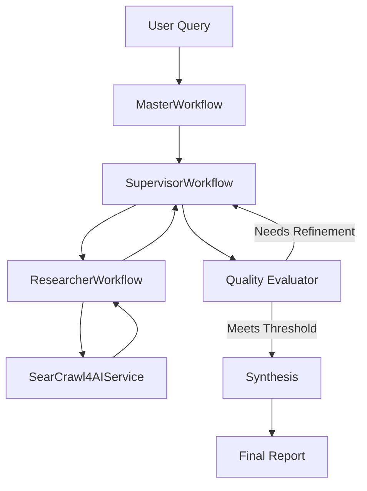
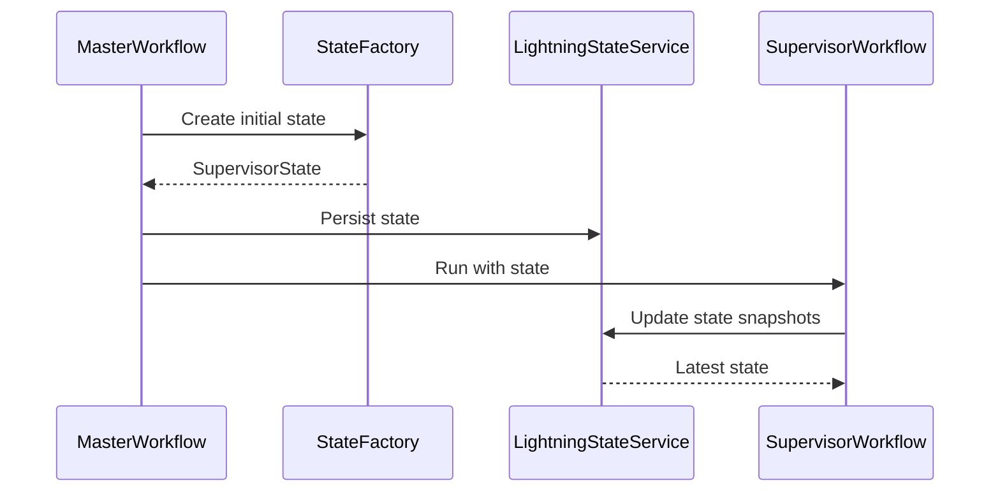
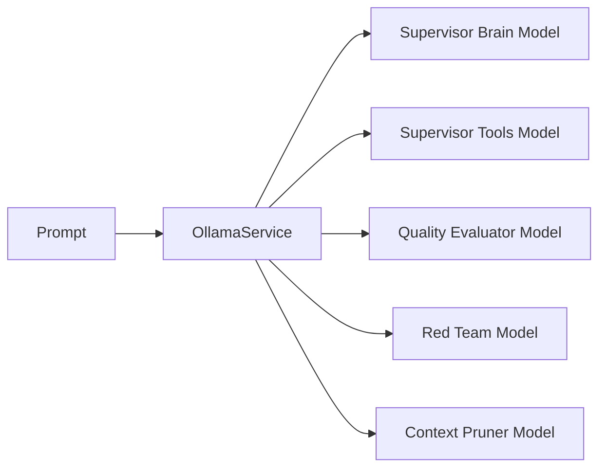
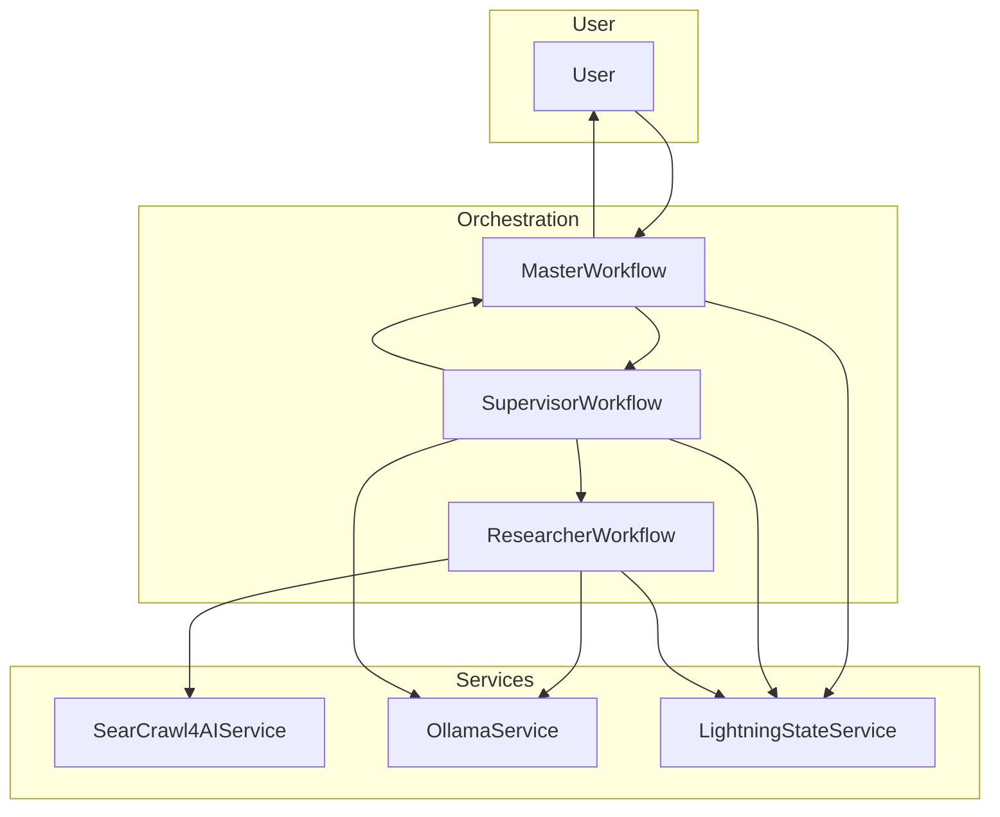

# Architecture

## Overview

The Deep Research Agent is a multi-workflow system that runs a diffusion-based research refinement loop. It orchestrates intent clarification, research, evaluation, critique, and synthesis while persisting state for recovery and iterative improvement.

## Core Workflows

- `MasterWorkflow`: Entry point that coordinates the full research pipeline.
- `SupervisorWorkflow`: Manages iterative refinement and quality convergence.
- `ResearcherWorkflow`: Performs focused research tasks and evidence gathering.
- `SearCrawl4AIService`: Executes search and content extraction.

### Workflow Flow

## State Management

State is stored and retrieved via `LightningStateService` and initialized through `StateFactory`. The `SupervisorState` tracks iteration progress, findings, and quality metrics.

## LLM Integration

LLM tasks are routed through `OllamaService` with `WorkflowModelConfiguration` defining which models handle reasoning, tools, evaluation, and pruning.

## Data Flow

## Deployment Considerations

- **Runtime**: .NET 8 or later.
- **LLM Endpoint**: Local `OllamaService` or remote compatible API.
- **Persistence**: Ensure `LightningStateService` backing store is durable for long runs.
- **Monitoring**: Optional Grafana/Prometheus stack for APO metrics.
- **Scaling**: Adjust concurrency limits through APO configuration for workload size.
